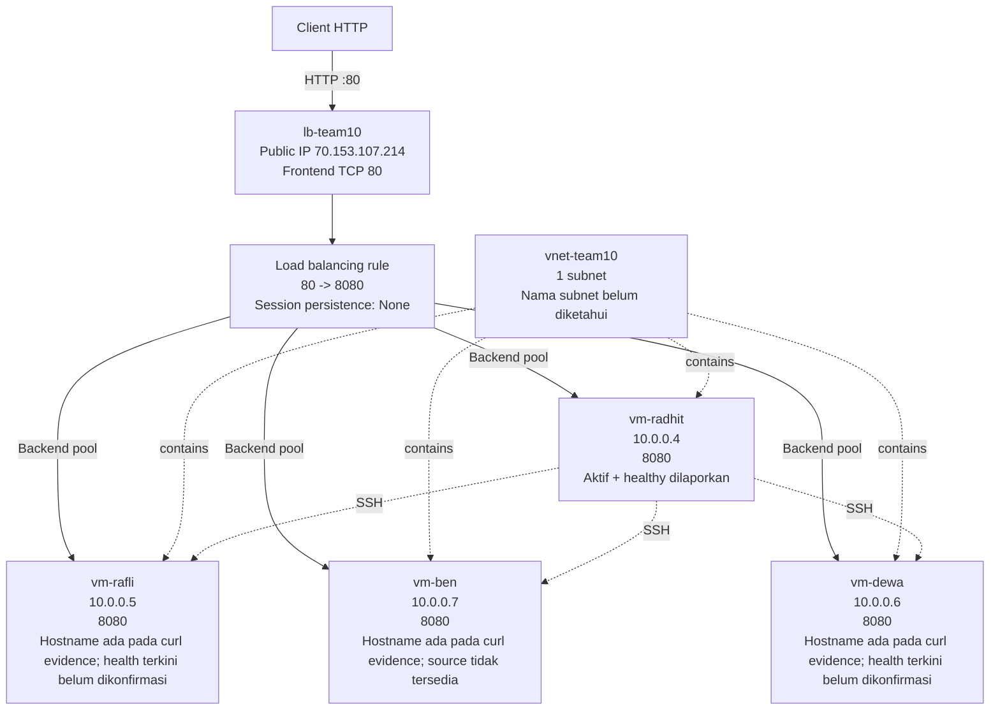

# Topologi Azure

## Diagram

Health probe memeriksa path `/` pada port `8080`. NSG mengizinkan TCP `8080` pada keempat VM.

## Resource yang diketahui

| Resource/fakta | Nilai | Status |
| --- | --- | --- |
| Resource group | `rg-ncc` | Diketahui |
| VNet | `vnet-team10` | Diketahui |
| Jumlah subnet | `1` | Diketahui |
| Nama subnet | Belum dikonfirmasi | Jangan ditebak |
| CIDR subnet | Belum dikonfirmasi | Jangan ditebak |
| Region | Belum dikonfirmasi | Jangan ditebak |
| Load Balancer | `lb-team10` | Diketahui |
| Public IP Load Balancer | `70.153.107.214` | Verifikasi ulang sebelum submission |
| SKU Load Balancer | Belum dikonfirmasi | Jangan ditebak |
| Frontend/backend | `80` -> `8080` | Diketahui |
| Probe | `8080`, path `/` | Diketahui |
| Interval/threshold probe | Belum dikonfirmasi | Jangan ditebak |
| Session persistence | `None` | Diketahui |
| Public IP `vm-radhit` | Belum dikonfirmasi | Jangan ditebak |
| Nama NSG | Belum dikonfirmasi | Jangan ditebak |
| OS image/version | Belum dikonfirmasi | Jangan ditebak |
| VM size aktual | `Standard B2ats v2` | Diberikan sebagai kondisi aktual |
| VM size requirement | `Standard_B1s` | Requirement tertulis |

Ukuran aktual `Standard B2ats v2` tidak diklaim memenuhi requirement `Standard_B1s`. Topologi aktual juga memakai empat VM, sedangkan `REQUIREMENT.md` meminta 2–3 VM; perbedaan ini dilaporkan secara transparan.

## Backend pool

| VM | Private IP | Source tersedia | Evidence/status |
| --- | --- | --- | --- |
| `vm-radhit` | `10.0.0.4` | `app/radhit/` | Container `web-radhit:latest` aktif dan healthy dilaporkan; hostname ada pada curl evidence |
| `vm-rafli` | `10.0.0.5` | `app/rafli/` | Hostname ada pada curl evidence; health portal belum dikonfirmasi |
| `vm-dewa` | `10.0.0.6` | `app/dewa/` | Hostname ada pada curl evidence; health portal belum dikonfirmasi |
| `vm-ben` | `10.0.0.7` | Belum tersedia | Hostname ada pada curl evidence; health portal belum dikonfirmasi |

`docs/evidence/curl-loop.txt` berisi respons dengan empat hostname, tetapi tidak mencatat timestamp atau command asal. Ini bukti respons lintas-backend pada waktu pengambilan yang tidak diketahui, bukan bukti bahwa semua backend masih aktif atau healthy sekarang. Screenshot Azure Portal semua backend healthy belum tersedia.
